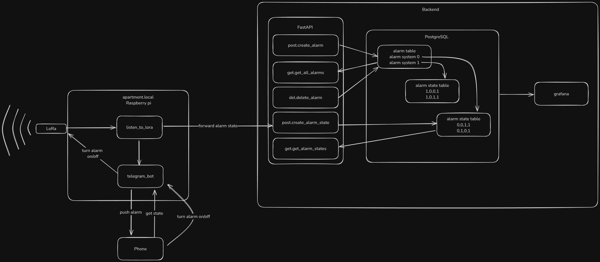

# Alarm system

This project contains the code for an alarm system that can be used to monitor windows or doors in our house. 
The system is based on a Raspberry Pi 4 Model B and uses buttons to detect if a window or door is opened or closed.
In my case, I am using the system to detect intruders, in our cellar room. In case of a detection, a notification is sent
to my phone. In addition, an alarm sound is played in order to scare the intruder away.
In 2024, we had 4 break-ins/beak-in attempts. I hope that with this system will be able to prevent future break-ins. 

## System design
The system is split into a transmitter, a receiver and a server backend. Below you can see the system design of the transmitter.

There are multiple threads running on the transmitter system. Two are constantly observing the buttons, which are attached to the 
door in our cellar. A third thread is observing the local alarm state. If the alarm is triggered, the alarm sound is played.
A forth thread is sending the alarm state via LoRa to my second Raspberry Pi every 15 minutes. This thread is also listening 
for ON/OFF events. Therefore, it is a bidirectional communication, however in 99% of the time, the transmitter is sending. 

Below you can see the system design of the receiver module and the server backend.


The receiver module is simply listening for incoming LoRa messages which are then forwarded to the backend server. 
The backend server has a FastAPI REST API, which is used to store the alarm state in a postgres database. In addition,
a Grafana dashboard is used to visualize the alarm state.
The receiver module is also running the Telegram bot, which is also used to forward incoming alarm messages to my phone.
In addition, the Telegram bot interface can also be used to turn the alarm on or off.


## Raspberry Pi 4 Model B setup

### OS setup

1. Install the rpi-imager `sudo apt install rpi-imager`
2. Go to settings and:
   1. Configure a hostname
   2. Enable ssh and allow public key usage only
   3. Paste a public key
   4. Configure wireless LAN
   5. Set your timezone
3. Finally, select your SD and flash the SD card with an operating system, such as Ubuntu Server 24.04 LTS.

### Setup ssh
1. Go to `~/.ssh` and add the following configuration entry:
    ```
    Host <your selected host name from OS setup>
         HostName <the IP address of the Raspberry Pi> <- You can get the IP by logging into your router
         User <username from OS step>
         Port 22
         IdentityFile ~/.ssh/your_private_key
    ```
2. Now run ssh <your selected host name> and enter your ssh key password
3. You should be logged into your Raspberry Pi now
4. If you get an error, our your connection does not work, mount the SD card on your system, add an empty file named `ssh` to the boot partition, and try again.
5. If it still does not work, edit the file `/etc/sshd_config` and set `PasswordAuthentication no`, `Port 22` and `PubkeyAuthentication yes`, reboot the Raspberry PI and try again.

### Enable serial port

1. Run `sudo apt install raspi-config` and run `sudo raspi-config`
2. Navigate to `Interfacing Options` -> `Serial Port` and enable the serial port. Do not make your login shell accessible over serial!

### Setup Python

1. run `sudo apt-get update && sudo apt-get upgrade`
2. run `sudo apt install python3-pip` to install the python package manager
3. run `sudo apt install python3-rpi-lgpio` to install the GPIO library

# Demo
[Link to Grafana Dashboard](https://grafana.memomate.me/public-dashboards/ea42cdf5d8614cfd9fa721148ae74071?refresh=auto&orgId=1&from=now-24h&to=now&timezone=browser)

[Link to YouTube video](https://youtu.be/yvn0n6daogU)